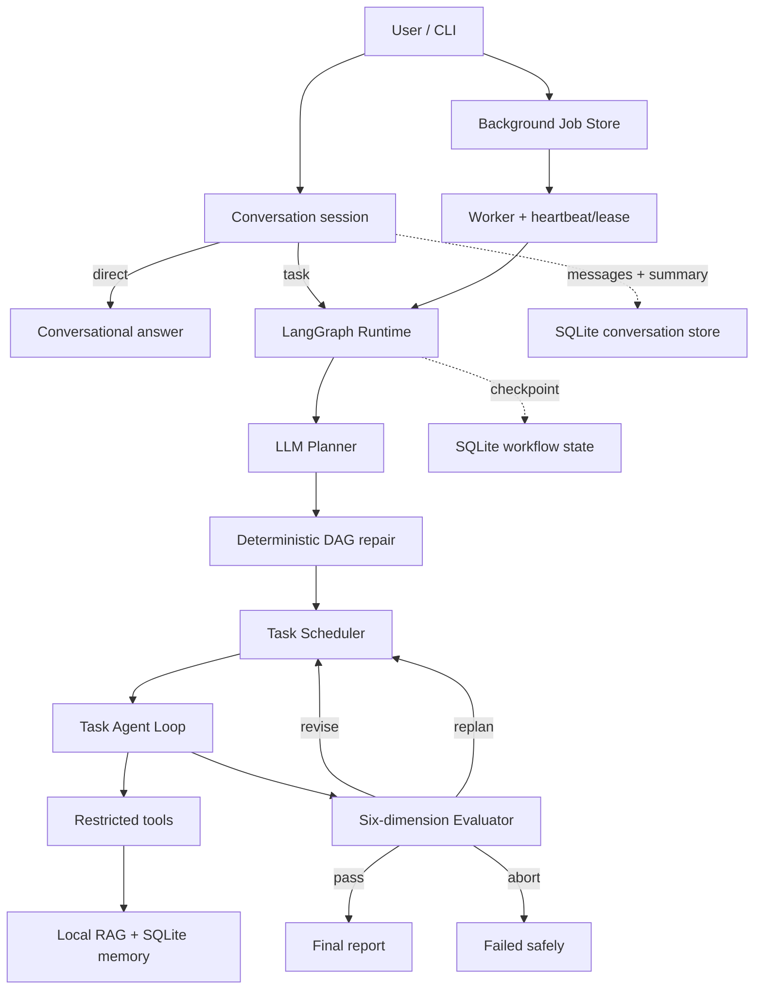

# Durable Agent Runtime

A persistent conversational Agent with a durable, dependency-aware and evaluation-driven task runtime, built with Python, LangGraph and SQLite.

## Background conversation tasks

Long research requests can return immediately while the durable Worker continues in another process:

```powershell
durable-agent chat "调研 Agent checkpoint 并生成报告" `
  --session internship-demo `
  --background
```

The first reply contains a `job_id`. The user can keep chatting or exit the process. After the Worker completes and the Evaluator accepts the result, the report is written back to the same persistent session:

```powershell
durable-agent session show internship-demo
durable-agent status <job_id>
```

The conversation acknowledgement, Job record, LangGraph checkpoint and final report are separate durable records. Result delivery is idempotent: retrying a Worker cannot append the same `job_id` report twice.

这个项目把学习阶段的 Stage 2 与 Stage 3 能力整理为一个统一、可独立上传 GitHub 的工程：LLM 负责语义规划和任务决策，确定性 Runtime 负责 DAG 校验、工具边界、状态机、持久化、后台执行与质量门。

## 核心能力

- 本地 RAG：Markdown 加载、切块、检索和 citation-ready evidence。
- 持久化对话：同一 `session_id` 延续多轮消息，自动选择直接回答或任务 Runtime。
- 上下文压缩：完整消息保留在 SQLite，模型只接收会话摘要和最近消息。
- Agent Loop：模型决策、受限工具调用、观察、有限步数和重复调用缓存。
- 长期记忆：SQLite memory store 与相关记忆检索。
- LLM Planner：自然语言目标转 Task DAG，程序修复 ID、依赖、类型与环。
- 动态 Replanner：结合失败任务、已有结果和 Evaluator 反馈生成修订 DAG，并安全复用未变化的已完成任务。
- Task Runtime：research、analysis、report 依赖调度、失败传播和有限重试。
- LangGraph Checkpoint：使用 `thread_id` 跨进程恢复执行状态。
- Background Jobs：SQLite 队列、原子 claim、heartbeat、lease、取消、重试和日志。
- Evaluator：目标覆盖、答案质量、证据支撑、引用完整性、执行可靠性和校准。
- 质量闭环：`pass / revise / replan / abort` 驱动 Graph 后续动作。
- 引用契约：多条 research 分支汇总时统一去重、重新编号；未知引用在 Agent Loop 内被拒绝并要求重写。
- 固定评测集：版本、指纹、四分类指标、混淆矩阵和 CI quality gate。
- 端到端评测：隔离 Conversation、Memory、Checkpoint 与 Trace，记录任务完成率、路由、首次通过率和引用合法率。
- 可观察性：控制台紧凑进度，完整事件写入 JSONL trace。

## 架构



核心边界：

```text
LLM：理解目标、提出计划、生成任务结果
程序：验证结构、限制工具、控制状态、保存进度、决定是否接受结果
```

## 快速开始

要求 Python 3.11+。

```powershell
cd durable-agent-runtime
python -m venv .venv
.\.venv\Scripts\Activate.ps1
python -m pip install -e .
```

离线确定性演示，不需要 API Key：

```powershell
durable-agent run "explain durable Agent checkpoint recovery" --mode deterministic
```

默认允许 3 次质量评估（初评加最多 2 次修订）。任务执行失败重试与 Evaluator 成品修订使用独立预算，互不挤占。

完整 LLM 模式：

```powershell
Copy-Item .env.example .env
# 编辑 .env，填入 DEEPSEEK_API_KEY

durable-agent run "调研 Agent 持久化、后台任务和质量评估，并生成报告"
```

启动持久化对话：

```powershell
durable-agent chat --session internship-demo
```

同一个 session 可以在之后继续，也可以单次发送消息：

```powershell
durable-agent chat "刚才报告里 checkpoint 和 Job Store 有什么区别？" --session internship-demo
durable-agent session show internship-demo
```

需要额外语义裁判时：

```powershell
durable-agent run "your goal" --evaluator hybrid
```

默认 `rules` 不增加 Judge 调用；`hybrid` 将确定性维度分与 LLM 语义评分聚合，但空答案、未知引用等硬失败仍不可被高分覆盖。Judge 不可用时自动降级到规则评分并记录 warning。

也可以始终使用：

```powershell
python -m durable_agent <command>
```

## 统一命令入口

```text
chat       启动或继续持久化对话；自动选择 direct 或 task
session    列出会话或查看完整历史
run        前台执行完整 Agent Runtime
resume     从 LangGraph SQLite checkpoint 继续
submit     提交后台任务并立即返回
start      启动一个 queued Job
status     查看后台 Job
list       列出后台 Jobs
wait       等待后台 Job，只在状态变化时输出
cancel     协作式取消并终止子进程树
retry      对终态 Job 创建新 thread 后重跑
logs       查看有限行日志尾部
recover    回收 lease 过期的任务
evaluate   独立评估一个 JSON 输出
benchmark  运行版本化固定评测集
e2e-run    运行隔离的端到端 Agent 开发评测集
e2e-compare 对比 single-pass、无质量闭环与完整 Agent
fault-test 强杀子进程并验证同一 checkpoint thread 恢复
memory     添加或检索长期记忆
```

## 对话模式

```powershell
durable-agent chat --session demo
```

交互命令：

```text
/history   查看该 session 的完整消息历史
/exit      退出；消息仍保留在 SQLite
```

每一轮先经过路由器：普通交流、解释和追问走 `direct`；明确要求调研、比较、评估或生成报告时走 `task`，复用 Planner、Task DAG、Agent Loop 与 Evaluator。路由器会根据会话摘要解析“它”“刚才的报告”等指代。

默认活动上下文保留摘要和最近 8 条消息。旧消息被压缩进摘要，但完整原文仍保存在 `data/conversations.sqlite`，可用于审计和后续评测。这里的 conversation session、LangGraph `thread_id` 和后台 `job_id` 是三个不同标识：一个 session 可以产生多个任务 run。

## 前台运行与恢复

指定稳定的 thread：

```powershell
durable-agent run "explain durable Agent checkpoint recovery" `
  --mode deterministic `
  --thread-id demo-001
```

恢复未完成的 thread：

```powershell
durable-agent resume demo-001 --mode deterministic
```

默认 checkpoint 位于 `data/checkpoints.sqlite`。Checkpoint 保存业务图进度，不等同于后台 Job 状态。

## 后台长任务

```powershell
durable-agent submit "调研 durable Agent runtime 并生成报告"
```

返回：

```text
submitted job_xxxxxxxxxxxx status=queued
worker_pid=12345
```

管理任务：

```powershell
durable-agent list
durable-agent status <job_id> --tail 15
durable-agent wait <job_id>
durable-agent logs <job_id> --lines 30
durable-agent cancel <job_id>
durable-agent retry <job_id>
durable-agent recover --start
```

只入队、稍后启动：

```powershell
durable-agent submit "your goal" --no-start
durable-agent start <job_id>
```

后台 Job Store 回答“任务是否活着”，LangGraph checkpoint 回答“业务执行到哪里”，两份持久化不能互相替代。

## Evaluator

独立评估一个结果：

```powershell
durable-agent evaluate examples/evaluation_input.json --json
```

质量门使用六个维度：

| Dimension | Weight |
|---|---:|
| Goal coverage | 0.25 |
| Answer quality | 0.20 |
| Groundedness | 0.20 |
| Citation integrity | 0.15 |
| Execution reliability | 0.10 |
| Calibration | 0.10 |

结构硬失败不能被平均分覆盖，例如空答案、程序 fallback、未知 citation 和非法 confidence。

## 固定评测集

```powershell
durable-agent benchmark
durable-agent benchmark --json
durable-agent benchmark --output benchmark_results/latest.json
```

项目自带 25 个 starter regression cases（`pass=6 / revise=8 / replan=7 / abort=4`），覆盖中英文与六个质量维度。它用于 CI 防退化，不是未见 held-out 集，不能把其结果包装成真实世界准确率。

后续人工评测建议：冻结当前规则，另建未参与调参的 private held-out labels，再报告 pass precision、action macro-F1、critical issue recall 和 bootstrap 置信区间。

## 端到端 Agent 评测

运行12条可见开发任务：

```powershell
durable-agent e2e-run --mode deterministic
```

运行真实 LLM，并对每条任务重复三次：

```powershell
durable-agent e2e-run `
  --mode llm `
  --repeats 3 `
  --output results/e2e/dev-llm-v1
```

只运行指定 case：

```powershell
durable-agent e2e-run --mode llm --case research_001
```

每个 case 使用独立的 Conversation、Memory、Checkpoint 和 Trace 数据，防止跨 case 污染。结果目录包含 `manifest.json`、`metrics.json`、`runs.jsonl`、`report.md` 和每次运行的 SQLite/trace 审计材料。

`evals/e2e/dev.jsonl` 是参与开发的公开回归集，其分数不能作为 held-out 准确率或简历最终指标。简历指标需要在冻结代码和评分规则之后，使用另一套未参与调优的人工 sealed held-out 集产生。

对比三种执行变体：

```powershell
durable-agent e2e-compare --mode llm --repeats 3
```

- `single_pass`：相同本地证据，一次生成，无 Planner、DAG 和质量修订。
- `no_quality_loop`：完整任务执行，但 Evaluator 只测一次，不能 revise/replan。
- `full`：完整 Planner、Task Runtime 和质量闭环。

## 故障注入与恢复评测

```powershell
durable-agent fault-test --mode deterministic
```

该命令在已持久化边界后的 `execute`、`handle`、`evaluate` 和 `finalize` 节点前打开故障窗口，由父进程强制终止 Agent，再使用同一 `thread_id` 和 checkpoint 数据库恢复。只有最终 `pass` 且中断前已完成任务没有被重新调度，才计为恢复成功。

扩大重复次数：

```powershell
durable-agent fault-test `
  --dataset evals/fault/cases.jsonl `
  --point schedule --point execute --point handle --point evaluate --point finalize `
  --repeats 2
```

上面的冻结配置是6个 workload × 5个 checkpoint 边界 × 2次重复，共60次故障注入。

开发 smoke 的恢复率不能直接写入简历。最终指标应使用冻结版本、多个任务、多个中断位置和预先确定的重复次数，保存完整 `fault-results.json` 与 trace。

## 长期记忆

```powershell
durable-agent memory add "Checkpoint 不自动保证外部副作用幂等" --kind lesson
durable-agent memory search "checkpoint 幂等"
```

Memory 保存跨会话复用的知识；Conversation Store 保存消息与摘要；Runtime checkpoint 保存单次 Task Graph 的执行进度，三者不是同一个概念。

## 测试

```powershell
python -m unittest discover -s tests -v
durable-agent benchmark
```

GitHub Actions 会同时运行单元测试和 Evaluator quality gate。

## 项目结构

```text
durable-agent-runtime/
├── .github/workflows/tests.yml
├── examples/
├── src/durable_agent/
│   ├── agent.py          # Task Agent Loop
│   ├── benchmark.py      # fixed-set metrics and quality gate
│   ├── chat.py           # conversational routing and context compression
│   ├── cli.py            # unified command entry
│   ├── conversation.py   # SQLite sessions and complete message history
│   ├── evaluator.py      # deterministic six-dimension quality gate
│   ├── e2e.py            # isolated end-to-end runner, scorer and report
│   ├── baseline.py       # comparable single-pass baseline
│   ├── fault.py          # process-kill fault injection and recovery metrics
│   ├── jobs.py           # durable background jobs
│   ├── llm.py            # OpenAI-compatible DeepSeek client
│   ├── memory.py         # SQLite long-term memory
│   ├── models.py         # explicit runtime/task state
│   ├── persistence.py    # LangGraph SQLite checkpointer
│   ├── planner.py        # LLM plan + deterministic DAG repair
│   ├── rag.py            # local retrieval
│   ├── runtime.py        # parent LangGraph and evaluation loop
│   ├── tools.py          # tool registry and risk boundaries
│   ├── trace.py          # JSONL observability
│   ├── eval_set/
│   └── sources/
├── tests/
├── evals/e2e/            # visible development tasks and rubric
├── .env.example
└── pyproject.toml
```

## 当前限制与路线

- 当前 RAG 是轻量本地词法检索，适合演示 Runtime，不代表生产检索质量。
- SQLite 后台队列定位单机学习与原型；分布式部署应替换为正式队列和数据库。
- Checkpoint 是节点级恢复；外部写操作仍需幂等键和补偿机制。
- Starter fixed set 参与过规则开发；真实指标需要新的人工 held-out 集。
- 当前重点是可靠单 Agent Runtime，尚未加入 Subagent 和 Multi-Agent。

下一阶段建议先建立端到端任务集和 private held-out 标注，再决定是否引入 Subagent。
